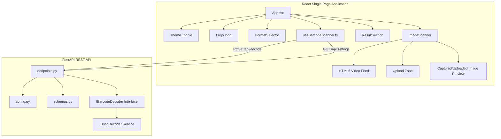

# SPEC.md - System Specification Document (SDD)

This document defines the system specifications, data formats, state contracts, and interface contracts for the **QuickCodeLector** application. Future AI agents must check modifications against these specifications to ensure compliance.

---

## 1. System Components & Architecture



---

## 2. API Specifications & Contracts

### 2.1 GET `/api/settings`
Retrieves the application configurations.

- **Request:** None
- **Response Content-Type:** `application/json`
- **Response Schema:**
  ```json
  {
    "max_file_size_bytes": 2097152
  }
  ```

### 2.2 POST `/api/decode`
Receives image file payload, validates structure, and decodes content.

- **Request Content-Type:** `multipart/form-data`
- **Request Form Parameters:**
  - `file`: `UploadFile` (Required. Image byte stream, verified against MIME `image/*`)
  - `format`: `string` (Optional. Choices: `AUTO` | `QR` | `DATAMATRIX` | `AZTEC` | `EAN` | `POSTCODE`. Default: `AUTO`)
- **Response Content-Type:** `application/json`
- **Response Schema (`DecodeResponse`):**
  - **Success Response (Code Legible):**
    ```json
    {
      "success": true,
      "content": "https://google.com",
      "format": "QRCode",
      "message": null
    }
    ```
  - **Failure Response (No code detected or invalid format):**
    ```json
    {
      "success": false,
      "content": null,
      "format": null,
      "message": "Could not decode any barcode or 2D code matching the 'QR' selection."
    }
    ```

---

## 3. Frontend States & UI Contract

### 3.1 Theme State
- **Storage Mode:** Sync to `localStorage` key: `"theme"`.
- **Allowed States:** `"light"` (default) | `"dark"`.
- **Target CSS Target:** Set element `data-theme` attribute on root `<html>` tag: `<html data-theme="light">` or `<html data-theme="dark">`.

### 3.2 Scanning Hook States (`useBarcodeScanner.ts`)

| State Variable | Type | Default Value | Description |
| :--- | :--- | :--- | :--- |
| `barcodeFormat` | `string` | `"AUTO"` | Selected code format filter |
| `inputMethod` | `"upload" \| "camera"` | `"upload"` | Source method of scan target |
| `file` | `File \| null` | `null` | Chosen upload or captured file handle |
| `previewUrl` | `string \| null` | `null` | Image preview object URL blob pointer |
| `isScanning` | `boolean` | `false` | Loading state for active backend API call |
| `scanResult` | `ScanResult \| null` | `null` | Holds `{ content, format }` parsed result |
| `error` | `string \| null` | `null` | Holds active scanner/camera error messages |
| `cameraActive` | `boolean` | `false` | Indicates if HTML5 camera video stream is active |
| `maxFileSize` | `number` | `2097152` | Local size boundary fetched from settings (default 2MB) |

### 3.3 Barcode & QR Code Recreation Layout Fidelity

Recreating a 2D matrix code (e.g., QR Code, Data Matrix, Aztec Code) from its text content alone is insufficient to guarantee that the generated code matches the original scanned image. This is because matrix codes have several variable parameters that affect module (dot) arrangement:
- **Error Correction Level (ECL):** Redundancy levels (e.g., QR Code levels L, M, Q, H) modify the grid size and internal pixel configurations.
- **Mask Patterns:** Standard encoders apply penalty-minimizing mask patterns (8 choices for QR codes) to balance light and dark pixels, shifting module layouts entirely.
- **Symbology Versions:** Grid dimensions (versions 1-40 for QR Code, grid dimensions for Data Matrix) define the physical cell count.
- **Encoding Modes:** How the raw data is packed (ASCII, C40, numeric, alphanumeric, byte, kanji) directly changes the layout of data bits.

**Contractual Solution:**
To guarantee a dot-perfect visual replica:
- The backend `ZXingDecoder` retrieves the exact symbology parameters (ECL, mask patterns, versions) during decoding from the scanned image.
- Instead of using a client-side encoder that guesses parameters, the decoded C++ `Barcode` object on the backend calls `.to_svg()`. This outputs a vector SVG string preserving the identical dot layout.
- The React frontend consumes this SVG string and draws it onto a canvas for visual styling and export options.

---

## 4. UI Component Specification

1. **`FormatSelector`:**
   - Dropdown control containing matching values corresponding to API expected parameters (`AUTO`, `QR`, `DATAMATRIX`, `AZTEC`, `EAN`, `POSTCODE`).
   - Must be disabled during processing states (`isScanning = true`).
2. **`ImageScanner`:**
   - **Upload Tab:**
     - Render drop area binding dragging flags. Clicking triggers device browser select.
     - Show image size limits computed dynamically using `maxFileSize` (e.g. "Max 2MB").
     - On upload preview, clear action button must release memory pointer `URL.revokeObjectURL(previewUrl)`.
   - **Camera Tab:**
     - Initialize `getUserMedia` stream with back camera priority. Clean up tracks on unmount or tab switch.
     - Video tag must be rendered statically in the DOM (toggled via CSS `display` block/none styles) to avoid null Ref race conditions when the camera stream resolves.
     - On capture, Canvas capture converts feed frames to PNG blob stream, instantiating a temporary `File` object before sending.
     - **Capture Actions:** Saving capture File in `file`, creating object URL in `previewUrl`, and immediately shutting down video tracks via `stopCamera()`.
     - **Preview View:** If `previewUrl` is present, hide the video element and inactive UI and display the static preview image container.
3. **`ResultSection`:**
   - Evaluates results content. If matched against URL structures, render dynamic anchor element directing targets to new browser tab (`target="_blank"` and `rel="noopener noreferrer"`).
   - Clipboard copy provides interactive checkmarks, reverting state back after 2 seconds.
   - **Barcode Recreation:** Uses `bwip-js` to recreate the barcode/2D code on the fly in the UI.
     - Displays the recreated code inside a container styled with a solid white background to guarantee high contrast and scannability, regardless of the active visual theme.
     - Handles render failures gracefully, displaying a validation error message in the UI if the content does not match the rules of the code format.
     - Exposes two download actions: **Download PNG** (converts the canvas drawing to a downloadable raster image) and **Download SVG** (generates a clean vector-based file suitable for insertion into documents).
4. **`ThemeToggle`:**
   - Circular floating button in the top-right corner toggling between `"light"` and `"dark"`.
5. **Logo:**
   - The logo (`/favicon.svg`) is displayed in `.app-header` above the title `<h1>`, sized to `5.5rem` and styled with a pulsing micro-animation (`pulse-icon`).
6. **Browser Tab Title:**
   - Evaluates to `"Quick Code Lector"` configured inside `index.html`.

---

## 5. Deployment & Containerization Specs

### 5.1 Docker Architecture
The system supports deployment through `docker-compose` utilizing two isolated containers:

| Container / Service | Port Mapping | Base Image | Purpose |
| :--- | :--- | :--- | :--- |
| `backend` | `8000:8000` | `python:3.10-slim` | Runs Uvicorn FastAPI server |
| `frontend` | `8080:80` | `nginx:alpine` (Nginx multi-stage Node build) | Serves compiled React assets via Nginx |

### 5.2 Settings in Compose
- Environment variables (`MAX_FILE_SIZE_BYTES`) must be declared under the `backend` service block in `docker-compose.yml`.
- The frontend container uses Nginx static routes, serving the bundled files and proxying calls directly to the host machine's port 8000.

---

## 6. Verification Specifications (Test Cases)

### 6.1 Backend Test Rules
- **Rule 1:** Validates CORS options: accepts queries from origin clients `http://localhost:5173`.
- **Rule 2:** Rejects payloads over dynamic setting limit (`settings.MAX_FILE_SIZE_BYTES`) with standard response error models.
- **Rule 3:** Validates non-image contents, returning `success=false`.
- **Rule 4:** GET `/api/settings` must respond with active limits matching core Settings configuration.

### 6.2 Frontend Test Rules
- **Rule 1:** Asserts select inputs fire callback triggers.
- **Rule 2:** Result rendering displays the specific code symbology badge returned from backend.
- **Rule 3:** Copy button triggers clipboard writes and provides visual state transformations.
- **Rule 4:** Code imports must obey type-only import syntax rules (`import type { ... }`) for references to ensure compatibility with `verbatimModuleSyntax` rules.
